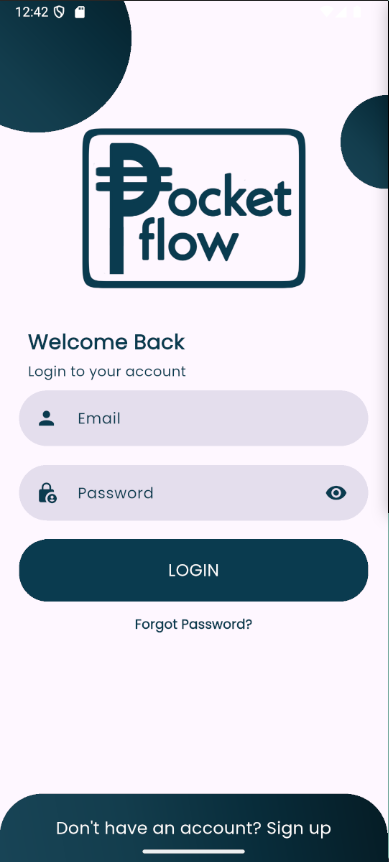
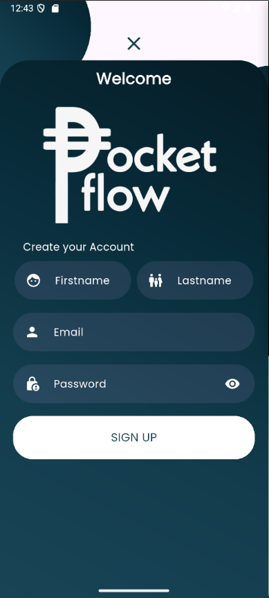
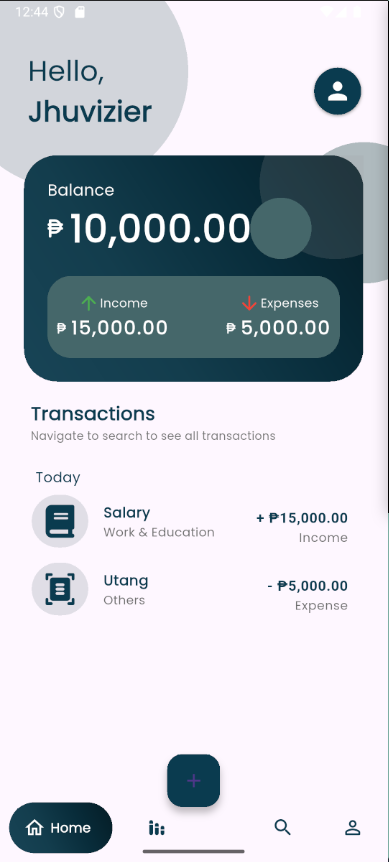
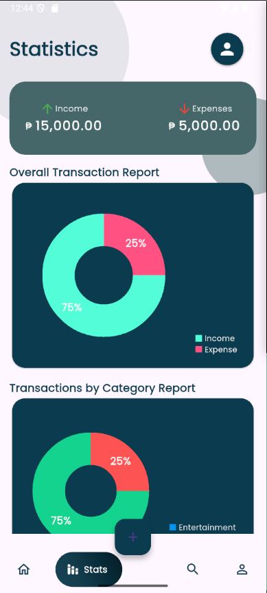
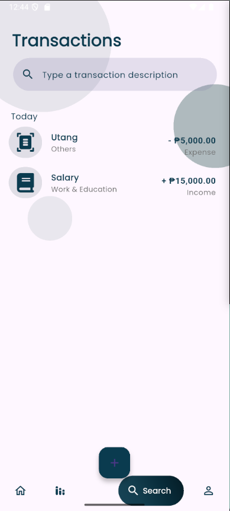
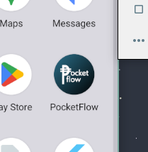

<p align="center">
  
</p>

# PocketFlow

**PocketFlow** is a personal finance tracker built with Flutter. It helps users manage their daily income and expenses in a clean, visual, and interactive way. With features like transaction tracking, category-based analytics, and profile management, PocketFlow simplifies money management and empowers users to stay financially aware and organized.

---

## Features

- 🔐 Secure login and registration
- 🏦 Real-time balance overview
- 📊 Pie chart analytics for transactions and spending categories
- 🗂️ Categorized transaction list (e.g., Work & Education, Entertainment, Others)
- 👤 Profile management and password reset
- 🔎 Transaction search functionality
- 📱 Responsive and modern mobile UI
- ✅ Built using null-safe Flutter and Dart

---

## Getting Started

### Prerequisites

- Flutter SDK 3.x
- Dart SDK 3.x
- Android Studio or VS Code
- Emulator or physical Android device

### Installation

```bash
git clone https://github.com/yourusername/PocketFlow.git
cd PocketFlow
flutter pub get
flutter run

```

## Screenshots

| Login Screen | Register Screen |
|--------------|-----------------|
|  |  |

| Home Page | Statistics |
|-----------|------------|
|  |  |

| Transaction Page | Profile Page |
|-------------|--------------|
|  |  |

---

## App Icon
<p align="center">
  
</p>

